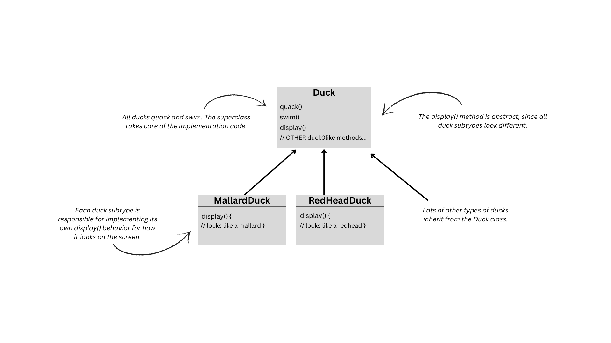
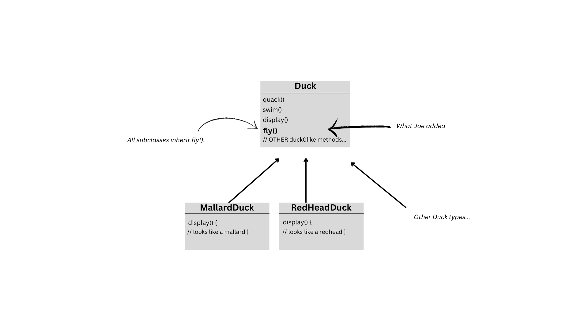
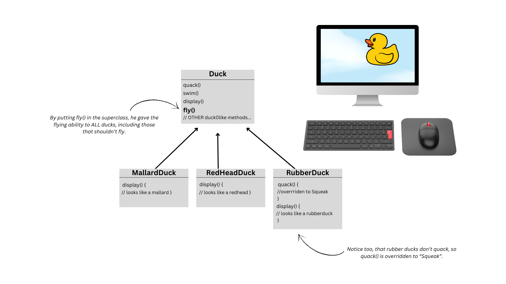
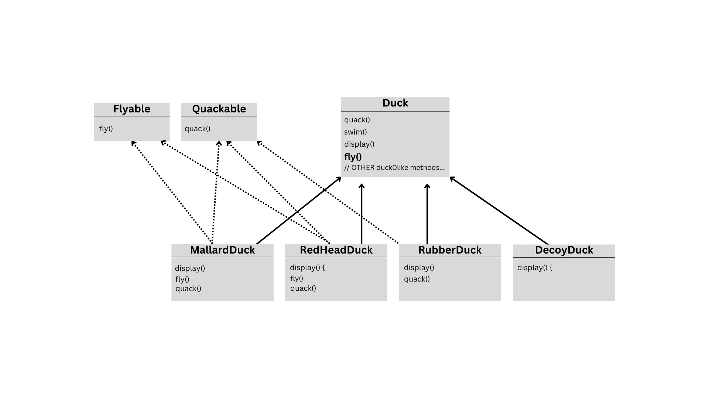
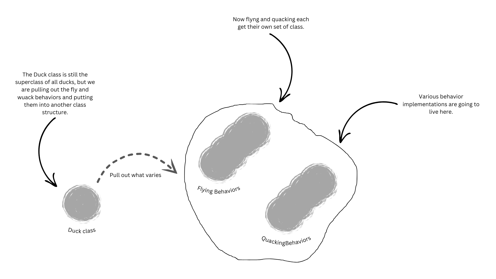
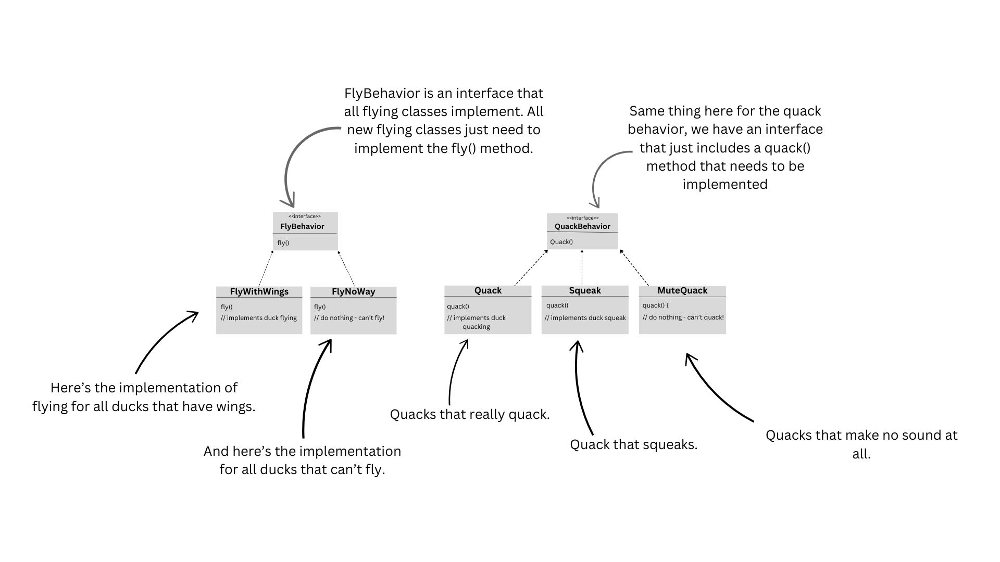
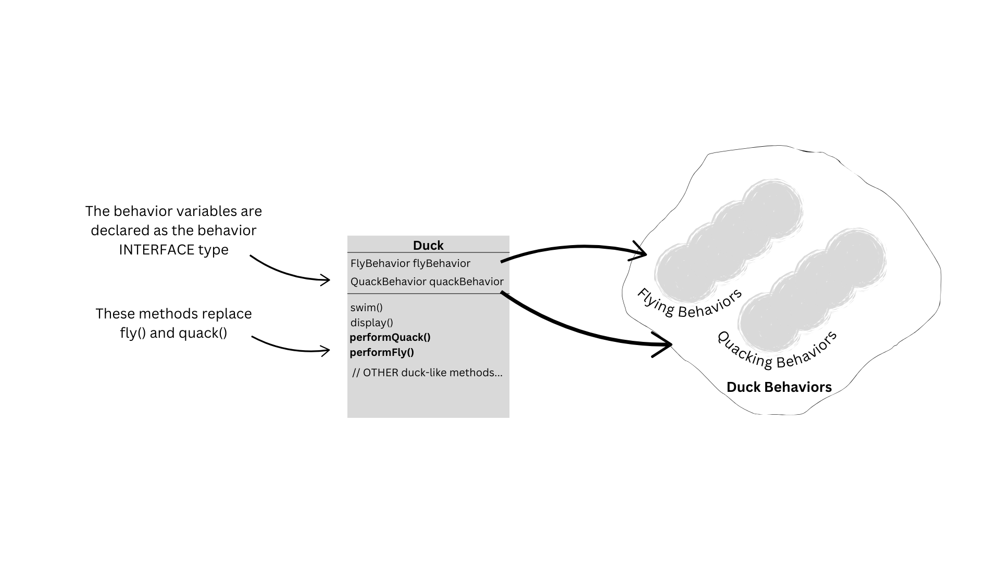
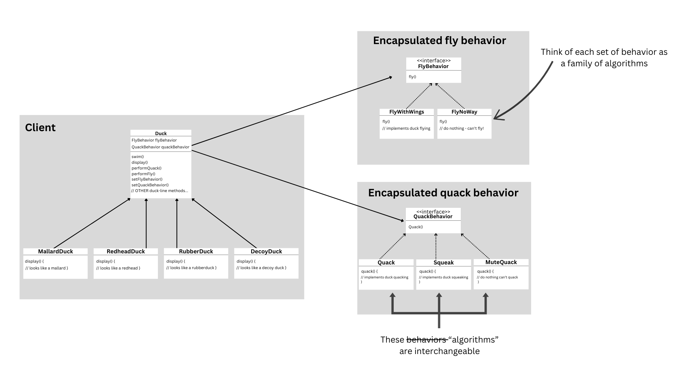

# Capítulo 1: Bem-Vindos ao Design Patterns (páginas 1 - 24)
[Leia o livro na íntegra aqui]([docs/guia.md](https://www.pdfiles.net/pdf/view/Head-First-Design-Patterns-2nd-Edition))

## Alguém já resolveu seus problemas

Neste capítulo, você aprenderá por que e como pode aproveitar o conhecimento e as lições aprendidas por outros desenvolvedores que enfrentaram os mesmos problemas de design e superaram esses desafios.

## Tudo começou com um simples simulador de patos

Joe trabalha para uma empresa que desenvolve um jogo de simulação de lago de patos de grande sucesso, chamado **SimDuck**.  
O jogo apresenta uma grande variedade de espécies de patos, que nadam e emitem sons de "quack".  
Os primeiros designers do sistema utilizaram técnicas clássicas de programação orientada a objetos (OO) e criaram uma superclasse `Duck`, da qual todas as outras classes de pato herdam.



## Mas agora precisamos que os patos VOEM!

Os executivos decidiram que patos voadores são o que o simulador precisa para superar a concorrência.  
Claro, o gerente de Joe disse a todos que isso não seria um problema para ele.  
*"Afinal", disse o gerente, "Joe é **O Cara** da programação orientada a objetos!"*



## Mas algo deu terrivelmente errado...
### *O que aconteceu?*

Joe não percebeu que nem todas as subclasses de `Duck` deveriam ser capazes de voar.  
Quando ele adicionou novos comportamentos na superclasse `Duck`, acabou incluindo funcionalidades que não eram adequadas para algumas subclasses.  
Como resultado, agora o jogo tem objetos como **patos de borracha voando** no **SimDuck**!



## Que tal usar uma interface?

Joe percebeu que a herança provavelmente não era a solução ideal, especialmente porque ele soube que os executivos querem que o SimDuck seja atualizado a cada 6 meses com novos recursos.  
Joe sabe que as especificações continuarão mudando, e ele teria que sobrescrever constantemente os métodos `fly()` e `quack()` em cada nova subclasse de `Duck` que for adicionada ao programa.  
Essa abordagem o prenderia em um ciclo infinito de manutenção.

Ele precisa de uma maneira mais elegante de permitir que apenas algumas, mas não todas, as subclasses de pato sejam capazes de voar ou emitir som.



## O que você faria se fosse o Joe?

Sabemos que nem todas as subclasses devem ter os comportamentos `fly` ou `quack`, então **a herança não é a resposta certa**.  
Implementar diretamente esses comportamentos nas subclasses resolveria parte do problema, mas destruiria completamente a reutilização de código e criaria um pesadelo de manutenção.

Além disso, pode haver mais de um tipo de comportamento para `fly()`, mesmo entre patos que realmente voam.

## Zerando o problema
Sabemos que usar herança não funcionou muito bem, já que o comportamento dos patos continua mudando entre as subclasses, e não é adequado que todas as subclasses possuam os mesmos comportamentos.

As interfaces Flyable e Quackable pareceram promissoras à primeira vista – apenas patos que realmente voam implementariam Flyable e assim por diante.
Porém, em Java, interfaces geralmente não contêm código de implementação, o que impede a reutilização de código.

Em qualquer caso, sempre que fosse necessário modificar um comportamento, seria preciso rastrear e alterar todas as subclasses onde esse comportamento foi definido, o que provavelmente introduziria bugs ao longo do processo.

Por sorte, existe um princípio de design para lidar com esse tipo de situação:

### **Design Principle: Identifique os aspectos que variam e separe-os do que permanece constante.**

Se você tem algo no código que muda frequentemente (como o comportamento de voo ou som), deve isolar essa parte das demais que não variam.  
Isso permite que você altere ou estenda as partes variáveis sem afetar as partes fixas.

## Separando o que muda do que se mantem o mesmo em `Duck`!

Por onde começamos? Pelo que podemos perceber, tirando os problemas com os métodos fly() e quack(), a classe Duck está funcionando bem, e não há outras partes que aparentem variar ou mudar com frequência. Então, com exceção de algumas pequenas alterações, vamos deixar a classe Duck praticamente intacta.

Agora, para separar as partes que mudam das que permanecem as mesmas, vamos criar dois conjuntos de classes (totalmente independentes da classe Duck): um para o comportamento de voo (fly) e outro para o comportamento de som (quack).
Cada conjunto de classes conterá todas as implementações do comportamento respectivo. Por exemplo, podemos ter uma classe que implemente o comportamento de "quack", outra que implemente "squeak" (guincho) e outra que implemente o silêncio.

Esses conjuntos de classes encapsularão os comportamentos variáveis, enquanto a classe `Duck` permanecerá responsável apenas pelos atributos e comportamentos comuns a todos os patos.
**Nós sabemos que fly() e quack() são partes de Duck que variam entre Ducks**
**Para** separar esses comportamentos da classe Duck, nós iremos **tirar ambos os métodos fora da classe Duck e criar um novo conjunto de classes para representar cada comportamento.**



## Projetando o design dos comportamentos de Duck

Como podemos projetar o conjunto de classes que implementam os comportamentos fly() e quack()?

Queremos manter as coisas flexíveis; afinal, foi a falta de flexibilidade nos comportamentos dos patos que nos colocou em apuros desde o início. Também sabemos que queremos atribuir comportamentos específicos às instâncias da classe Duck. Por exemplo, podemos criar uma nova instância de MallardDuck e inicializá-la com um comportamento específico de voo (fly()).

E, enquanto estamos nisso, por que não garantir que possamos alterar o comportamento de um pato dinamicamente? Em outras palavras, devemos incluir métodos setter nas classes Duck para que possamos modificar o comportamento de voo (fly()) de um MallardDuck durante a execução do programa.

Com esses objetivos em mente, vamos considerar nosso segundo princípio de design:

### **Design Principle: Programe para uma interface, não para uma implementação.**

Vamos usar uma interface para representar cada comportamento – por exemplo, FlyBehavior e QuackBehavior. Cada implementação de um comportamento será representada por uma classe que implementará uma dessas interfaces. Dessa vez, as classes de pato não irão implementar diretamente as interfaces de voo (FlyBehavior) ou som (QuackBehavior).

Em vez disso, criaremos um conjunto de classes cuja única responsabilidade será representar comportamentos específicos (por exemplo, "squeaking" ou "silence"). Essas classes de comportamento, e não as subclasses de Duck, irão implementar as interfaces correspondentes.

Com esse novo design, as subclasses de Duck usarão um comportamento representado por uma interface (FlyBehavior e QuackBehavior). Isso significa que a implementação real dos comportamentos (ou seja, o código concreto das classes que implementam FlyBehavior ou QuackBehavior) não estará presa às subclasses de Duck.

### **"Programar para uma interface" realmente significa "programar para um supertipo."**

A palavra interface está sendo usada de forma sobrecarregada aqui. Existe o conceito de uma interface, mas também o constructo de uma interface do Java. Você pode programar para uma interface sem precisar realmente usar alguma interface do Java. A ideia é explorar o polimorfismo programando para um supertipo, de modo que o objeto real em tempo de execução não fique fixo no código. E poderíamos reformular 'programar para um supertipo' como o tipo declarado de uma variável devendo ser um supertipo, geralmente uma classe abstrata ou interface, para que os objetos atribuídos a essas variáveis possam ser de qualquer implementação concreta do supertipo, o que significa que a classe que as declara não precisa saber sobre os tipos reais dos objetos!

## Implementando os comportamentos de Duck

Aqui nós temos duas interfaces, FlyBehavior e QuackBehavior, juntamente com as classes correspondentes que implementam cada comportamento.



**Note:** 
Com esse design, outros tipos de objetos pode reutilizar nossos comportamentos fly() e quack() por que tais comportamento não estão mais escondidos em nossas classes Duck.
E podemos adicionar novos comportamentos sem modificar nenhum dos nossos comportamentos já existentes ou mexendo mexendo nas classes Duck que usam comportamentos fly().

## Integrando os comportamentos de Duck

Aqui está o pulo do gato: A classe Duck vai delegar agora seus comportamentos fly() e quack(), ao invés de usar métodos quacking e flying definidos na classe Duck (ou subclasses). 

**Como?** 

- **1 Primeiro iremos adicionar duas variáveis de instâncias do tipo FlyBehavior e QuackBehavior** - 
vamos chamá-las flyBehavior e quackBehavior no runtime, como FlyWithWings para flying e Squeak para Quacking.

Iremos também remover os métodos fly() e quack() da classe Duck (e qualquer subclasse) por que nós movemos esse comportamento para as classes FlyBehavior e QuackBehavior.

Vamos substituir fly() e quack() em Duck com dois métodos similares, chamados performFly() e performQuack; você irá ver como eles funcionam depois.



- **2 Agora vamos implementar performQuack():** 
 
``` 
public abstract class Duck { 
        QuackBehavior quackBehavior; 
        //more
        
         public void performQuack() { 
         quackBehavior.quack(); 
        }
   }
```

Simples não? Para realizar o quack, um objeto Duck apenas pede para o objeto que é referenciado por quackBehavior para fazer o quack por ele. 

- **3 Ok, hora de se procupar sobre como as viaráveis de instâncias de flyBehavio() e quackBehavior() são setadas. Vamos dar uma olhada na classe MallardDuck:**

```
    public class MallardDuck extends Duck {
    
        public MallardDuck() {
        quackBehavior = new Quack();
        flyBehavior = new FlyWithWings();
    }
    
    public void display() {
        System.out.println("I'm a real Mallard Duck");
    }
}
```

O MallardDuck faz quack, não squeak e muito menos é muda. Quando um MallardDuck é instanciado, seu construtor inicializa a variável de instância quackbehavior herdada de Mallarducks para uma nova instância de tipo Quack (uma classe de implementação concreta de QuackBehavior).

``` 
    public abstract class Duck {
       
        FlyBehavior flyBehavior;
        QuackBehavior quackBehavior;
        
        public Duck() {

        public abstract void display();
        
        public void performFly() {
        flyBehavior.fly();
        
        public void performQuack() {
        quackBehavior.quack();

        public void swim() {
        System.out.println("All ducks float, even decoys!");
```
Agora vamos programar nossas interface FlyBehavior e suas classes que a implementam.

```
    public interface Flybehavior {
        public void fly();
    }
    
    public class FlyWithWings implements FlyBehavior { 
        public void fly() {
            System.out.println("I'm flying");
        }
    }
    
    public class FlyNoWay implements FlyBehavior {
    public void fly() {
        System.out.println("I can't fly!");
        }
    }
```

## Setando o comportamento dinamicamente

Que pena ter todo esse talento dinâmico embutido em nossos patos e não usá-lo! Imagine que você deseja definir o tipo de comportamento do pato por meio de um método setter na classe Duck, em vez de instanciá-lo no construtor ducks.

- **1 - Adicione dois novos métodos para classe Duck.**

```
        public void setFlyBehavior(FlyBehavior fb) {
            flyBehavior = fb;
        }
        
        public void setQuackBehavior(QuackBehavior qb) {
            quackBehavior = qb;
        }
```

- **2 - Faça um novo tipo Duck (ModelDuck.java).**

```
    public class ModelDuck extends Duck {
        public ModelDuck() {
            flyBehavior = new FlyNoWay();
            quackBehavior = new Quack();
        }
        
        public void display() {
            System.out.println("I'm a model duck");
        }
    }
```

- **3 - Faça um novo tipo FlyBehavior (FlyRocketPowered.java).**

```
    public class FlyRocketPowered implements FlyBehavior {
        public voic fly() {
            System.out.println("I'm flying with a rocket");
        }
    } 
```

- **4 - Mude a classe de teste (MiniDucksSimulator.java) adicione o ModelDuck, e faça ModelDuck ativar o rocketpowered.**
``` 
    public class MiniDuckSimulator {
        public static void main(String[] args) {
        
        Duck mallard = new MallardDuck(); 
        mallard.performQuack();
        mallard.performFly();
        
        Duck Model = new ModelDuck();
        model.performFly();
        model.setFlyBehavior(new FlyRocketPowered());
        model.performFly();  
      }
  }
```

Execute o código!

```
    %java MiniDuckSimulator
    Quack
    I'm Flying!
    I can't fly
    I'm flying with a rocket!
```

Para mudar um comportamento de Duck em runtime, apenas chame os setters de Duck e altere para comportamento desejado.
## A grande sacada em encapsular comportamentos

**Ok, agora que mergulhamos a fundo no design do Duck Simulator, é hora de dar uma pausa e dar olhada no projeto.**

Abaixo está toda a estrutura de classes que foi refatorada. Nós temos tudo que você esperaria: Ducks extendendo Duck, comportamentos de fly implementando FlyBehavior, e comportamentos quack implementando QuackBehavior.

Note também que começamos a descrever as coisas um pouco diferente. Ao invés de pensar nos comportamentos de de Duck como um conjunto de comportamentos, nós começamos a pensar neles como uma _família de algorítmos_. 
Pense a respeito: no design de SimDuck, os algoritmos representam coisas que um Duck faria (diferentes maneiras de quacking ou flying), mas nós podemos apenas usar facilmente as mesmas técnicas para um conjunto de classes que implementam as maneiras de computar impostos estaduais de diferentes estados. (SP, MG,BA...)

Preste atenção para os relacionamentos entre as classes. Na verdade pegue sua caneta e escreva as relações apropriadamente (IS-A, HAS-A, e IMPLEMENTS) em cada seta nesse diagrama de classes.



## HAS-A pode ser melhor do que IS-A

A relação HAS-A é uma interessante: cada duck tem um FlyBehavior e um QuackBehavior na qual delega flying e quacking.
Quando você põe duas classes juntas como essa, você está utilizando **composition**. Ao invés de _herdar_ seus comportamentos, os ducks pega seus comportamento sendo composto com o objeto de comportamento certo.

Isso é uma técnica importante, na verdade, é a base do nosso terceiro princípio de design:

### **Design Principle: Prefira composição ante herança**

Como você pôde ver, criar sistemas usando composition dá muito mais flexibiidade. Não somente permite você encapsular uma família de algoritmos em seus próprios conjuntos de classes, como também permite você **mudar o comportamento em runtime** desde que o objeto que você esteja compondo com implements a interface de comportamento correta.

Composition é usado em muitos design pattern e aqui você irá ver muito mais sobre as vantagens e desvantagens ao longo desse repositório.

## Parabéns pelo seu primeiro pattern!

Você acabou de aplicar seu primeiro pattern, o **STRATEGY PATTERN**. Você usou o Strategy para refatorar o app SimDuck.
Graças à esse pattern, o simulador está pronto para quaisquer mudanças.
Agora que percorremos um longo caminho para aprendê-lo, aqui vai uma definição formal desse pattern.

**The Strategy Pattern** define uma família de algoritmos, encapsula cada um, e faz eles serem intercambiáveis.
O Strategy permite o algoritmo variarem independentemente dos clientes que a utilizam.
